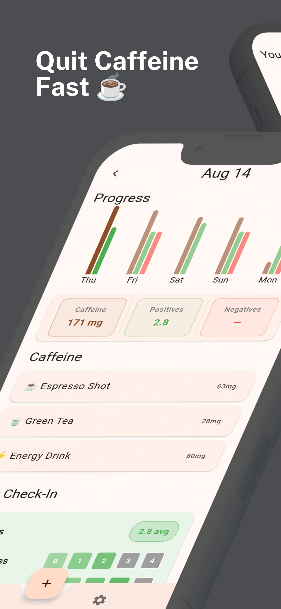
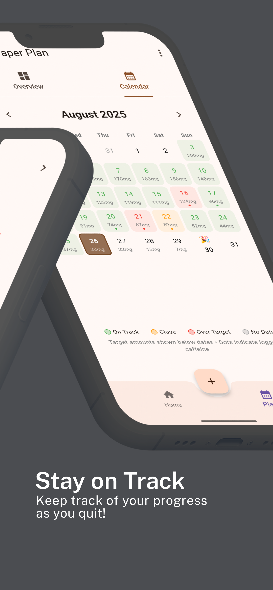
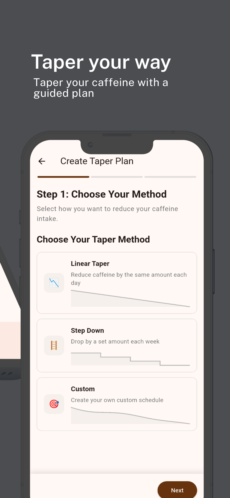

# Decaf

**A simple app for quitting caffeine. Plan, track, and monitor your caffeine intake until it hits 0.**

  
  &nbsp;&nbsp;&nbsp;&nbsp;
  

## Screenshots

  
  &nbsp;
  
  &nbsp;
  

## What it does

- Build your own quit plan - you choose the pace and timeline
- Shows your daily caffeine intake so you can see your progress
- Tracks withdrawal symptoms like headaches, fatigue, and mood changes

## Why it's awesome

#### 📈 See your progress

Charts show exactly how you're doing

#### 🎯 You're in control

Pick a plan that fits your life, not some algorithm's idea

#### 🩺 Know what to expect

Track headaches, fatigue, and other fun withdrawal stuff

## Gradual approach

✅ Gradual reduction works better than cold turkey. You decide how gradual.
